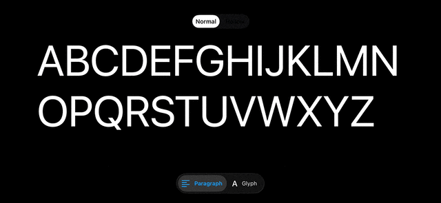
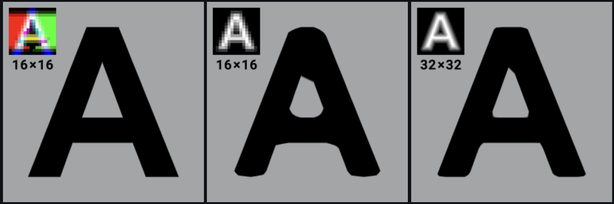
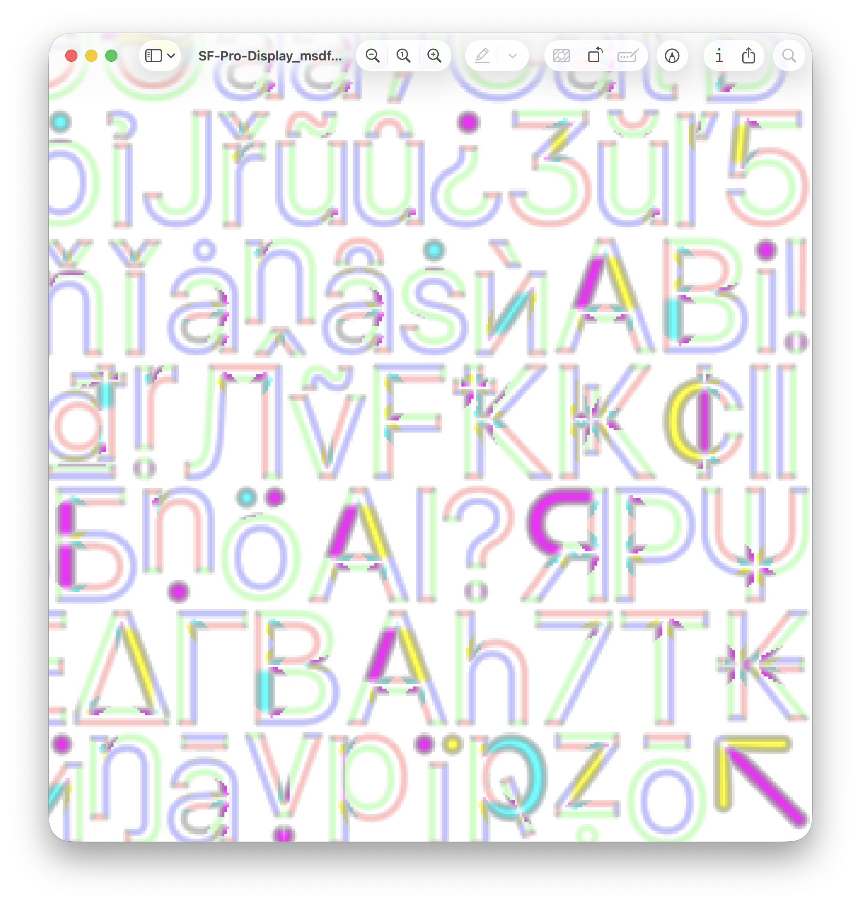
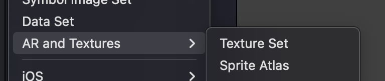
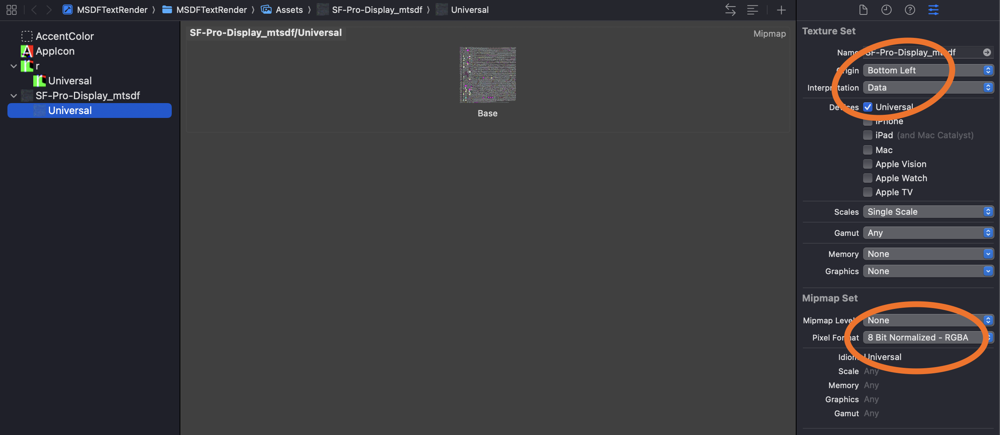

# Metal MSDF Text Rendering


Render crisp text in Metal using [multi-channel signed distance field](https://github.com/Chlumsky/msdfgen/tree/a4dafbac1c29021613fbc89768963f3a7e2105aa?tab=readme-ov-file#using-a-multi-channel-distance-field) (MSDF) technique.

This method has notable advantges over [single-channel signed distance fields](https://metalbyexample.com/rendering-text-in-metal-with-signed-distance-fields/): Sharp edges and support for hard-edge visual effects. Learn more at [msdfgen](https://github.com/Chlumsky/msdfgen?tab=readme-ov-file) Github page.



### 1. Choosing Unicode Coverage

`default_unicode_ranges.txt` contains a curated list of hex codepoint ranges for Western scripts. Edit this file or supply additional ranges on the command line to tailor coverage for your app. Large ranges increase atlas size, so scope them to what the UI needs.

*Glyph ranges*, unlike unicode ranges, are unique to each font. Thus if you have multiple fonts, you would need to generate a unique collection of glyph ranges per font.

### 2. Generating Glyph Ranges

`msdf-atlas-gen` consumes glyph indices, not Unicode codepoints. The helper script resolves the mapping by looking into the source font:

```bash
python3 MSDFTextRender/scripts/make_glyph_ranges.py \
    /path/to/font.otf \
    --ranges-file scripts/default_unicode_ranges.txt \
    --output scripts/glyph_ranges.txt \
    --include-missing
```

- `--ranges-file` accepts the Unicode ranges file you curated.
- `--include-missing` logs codepoints that are absent from the font so you can adjust coverage.
- The output file lists inclusive `[0xSTART, 0xEND]` glyph index spans; pass this file to `msdf-atlas-gen` via the `-glyphset` flag.

### 3. Baking the MTSDF Atlas

> Note: this step must be done on Windows.

Use Viktor's [msdf-atlas-gen](https://github.com/Chlumsky/msdf-atlas-gen), you may generate an efficiently binpacked font atlas for your font. Example invocation:

```
msdf-atlas-gen.exe ^
  -font path\to\SF-Pro-Display-Regular.otf ^
  -glyphset scripts\glyph_ranges.txt ^
  -type mtsdf ^
  -size 64 ^
  -pxrange 4 ^
  -imageout output\SF-Pro-Display_mtsdf.png ^
  -json output\SF-Pro-Display_mtsdf.json
```

Key parameters:

- `-type mtsdf` encodes the distance field in RGB for higher fidelity. You can also use `msdf` format. Differences are [discussed here](https://github.com/Chlumsky/msdf-atlas-gen?tab=readme-ov-file#atlas-types).
- `-size` sets the atlas resolution; increase for larger glyphs at the cost of memory.
- `-pxrange` defines the distance range stored in the atlas. Keep this in sync with the fragment shader logic (see “Runtime Rendering Pipeline”).

The batch file writes assets into an `output/` folder next to the script. Adjust executable paths, font paths, and output names to fit your environment or wrap the call in your own automation.

A subregion of atlas looks like below


### 4. Importing Assets Into the App

Copy the generated `.json` into `MSDFTextRender/MSDFTextRender/Resources` and ensure they are part of the application bundle. In this example, `Renderer.swift` looks for `SF-Pro-Display_mtsdf.json` and its companion image.

Copy the `.png` into a Texture Set. Create one in the Assets catalog if not exists. 

The following settings are critical.

1. **Origin: Bottom-Left**. This one is also set programmatically.
2. **Intepretation: Data**. Critical. The png is outputted in 8-bit RGB format without Alpha channel. Setting it otherwise can cause visual artifacts.
3. **Pixel format**. Critical. Set to 8 Bit Normalized RGBA. Otherwise visual artifacts will appear.



## Runtime Rendering Pipeline

### Loading the Atlas

`MSDFAtlas.load` decodes the JSON metadata into `MSDFAtlas`, capturing texture dimensions, font metrics, glyph quads, and the encoded `distanceRange`. `Renderer` loads the matching texture and derives `atlasUnitRange` from the atlas’ pixel range and texture size; this value keeps shader smoothing in sync with the baked `pxrange`.

### Text Layout and Mesh Generation

`MSDFTextMeshBuilder` uses Core Text to typeset attributed strings into lines and runs that obey layout constraints (frame size, margins, and scaling). For each glyph run, the builder:

- Looks up the glyph’s atlas and plane bounds.
- Produces two triangles forming a quad using glyph metrics in em space, translated and scaled into the render frame.
- Emits UV coordinates by normalizing atlas bounds against the atlas texture size.

The builder returns an `MSDFTextMesh` containing Metal vertex and index buffers plus the logical bounds of the laid-out text. `Renderer` rebuilds meshes when the drawable size or font selection changes, ensuring crisp spacing and kerning.

### Metal Shaders

The vertex shader multiplies positions by the model-view and projection matrices and forwards UVs. The fragment shader (`Shaders.metal`) performs bicubic sampling of the MSDF texture, collapses the RGB channels back into a signed distance value, and uses `fwidth` to adaptively scale the coverage ramp in screen space. This produces clean edges over a wide zoom range without re-rasterizing glyphs. The shader also applies the tint and opacity from the uniform buffer, enabling dynamic color changes.

```metal

fragment float4 fragmentShader(ColorInOut in [[stage_in]],
                               constant Uniforms & uniforms [[ buffer(BufferIndexUniforms) ]],
                               texture2d<float> colorMap     [[ texture(TextureIndexColor) ]])
{
    constexpr sampler colorSampler(address::clamp_to_edge,
                                   filter::bicubic);

    float3 sample = colorMap.sample(colorSampler, in.texCoord).rgb;
    float msdf = max(min(sample.r, sample.g), min(max(sample.r, sample.g), sample.b));
    float2 screenTexSize = 1.0f / fwidth(in.texCoord);
    float screenPxRange = max(0.5f * dot(uniforms.unitRange, screenTexSize), 1.0f);
    float screenPxDistance = screenPxRange * (msdf - 0.5f);
    float alpha = clamp(screenPxDistance + 0.5f, 0.0f, 1.0f);
    
    float4 color = uniforms.textColor;
    color.a *= alpha;
    return color;
}

```
## Practical Tips

- Keep atlas dimensions power-of-two friendly when targeting GPU compression or mipmapping workflows, though MT-SDF rendering works with arbitrary sizes.

- For multilingual UI, consider building multiple atlases grouped by script, then switch between them at runtime while reusing the mesh builder.

With this workflow you can regenerate glyph coverage, rebuild the MSDF atlas, drop the assets into the project, and immediately render high-fidelity, scalable text in Metal.

## Paragraph Modes

On the Paragraph tab, a segmented control toggles between two render styles:

- `Normal`: Standard MSDF fill with adaptive smoothing.
- `Border`: Renders a hard border (outline) around glyphs using the MSDF distance, with a small feather for anti-aliased edges. The default border is cyan with 2 px width. You can tweak color/width in `Renderer.swift` via `strokeColor`, `strokeWidthPx`, and `strokeFeatherPx`.

## Swift Package: MSDFText

Atlas decoding, glyph typesetting, and rendering have been extracted into a reusable Swift Package `MSDFText` in `Sources/MSDFText` with a simple API. The package expects you to supply the atlas `MTLTexture` (PNG or other) so you can manage asset loading however you prefer.

Key types:
- `MSDFAtlas`: Decodes the JSON metadata for the MSDF atlas and provides glyph descriptors and metrics.
- `MSDFTextMeshBuilder`: Lays out text (CoreText) and builds a vertex/index mesh referencing the atlas UVs.
- `MSDFTextRenderer`: Owns the Metal pipeline and uniform buffers and encodes draw calls for a mesh and a provided `MTLTexture`.

### Add the package

Add the local package (this repo) in Xcode via Swift Package Manager. The library product is named `MSDFText`.

### Usage

```
import MetalKit
import CoreText
import MSDFText

// 1) Load atlas metadata and texture (you provide the texture)
let atlasURL = Bundle.main.url(forResource: "SF-Pro-Display_mtsdf", withExtension: "json")!
var atlas = try MSDFAtlas.load(from: atlasURL)

let loader = MTKTextureLoader(device: device)
let texURL = Bundle.main.url(forResource: "SF-Pro-Display_mtsdf", withExtension: "png")!
let atlasTexture = try loader.newTexture(URL: texURL, options: [
    .SRGB: false,
    .origin: MTKTextureLoader.Origin.topLeft,
    .generateMipmaps: false,
])

// 2) Build text mesh for your string
let ctFont: CTFont = /* create from your font */
let meshBuilder = MSDFTextMeshBuilder(device: device, atlas: atlas, font: ctFont)
let mesh = meshBuilder.buildMesh(for: "Hello MSDF!", in: view.bounds.size, margin: 16, scale: view.contentScaleFactor)!

// 3) Create renderer and encode draw
let renderer = try MSDFTextRenderer(device: device,
                                    pixelFormat: mtkView.colorPixelFormat,
                                    sampleCount: mtkView.sampleCount,
                                    atlasPxRange: atlas.pxRange)
renderer.setOrthoProjection(width: Float(mtkView.drawableSize.width),
                            height: Float(mtkView.drawableSize.height))
renderer.beginFrame()

let style = MSDFTextRenderStyle(textColor: SIMD4<Float>(1,1,1,1),
                                renderMode: 0, // 0=fill, 1=hollow
                                strokeColor: SIMD4<Float>(0,0.75,1,1),
                                strokeWidthPx: 2,
                                strokeFeatherPx: 1)
renderer.encode(encoder: renderEncoder,
                mesh: mesh,
                atlasTexture: atlasTexture,
                style: style)
```

Notes:
- You must provide the atlas `MTLTexture`. The renderer computes the MSDF unit range from `atlas.pxRange` and the texture size.
- The package includes the Metal shaders. No `ShaderTypes.h` is required; Swift-side uniforms mirror the shader layout.

What moved where:
- Atlas JSON decoding → `Sources/MSDFText/MSDFAtlas.swift`
- Mesh building/typesetting → `Sources/MSDFText/MSDFTextMesh.swift`
- Renderer + pipeline/shaders → `Sources/MSDFText/MSDFTextRenderer.swift`, `Sources/MSDFText/Shaders.metal`
